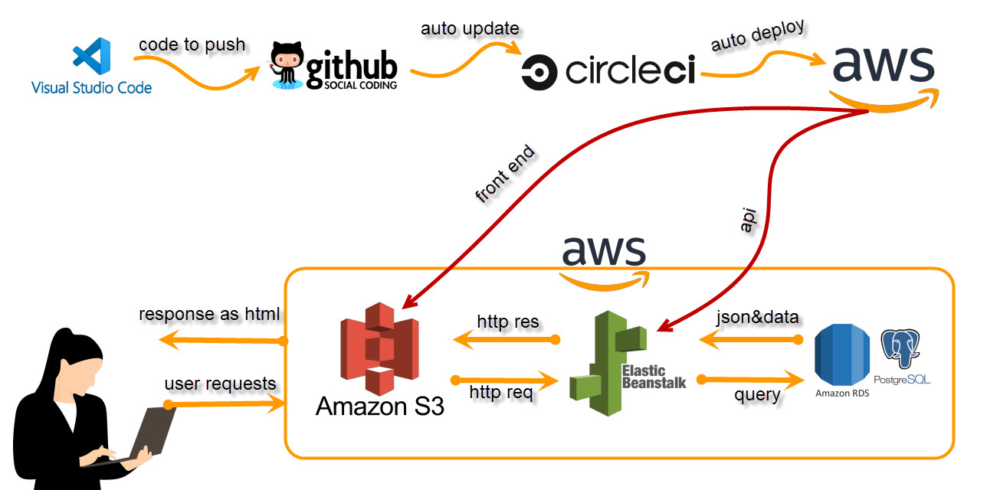

# Pipeline process

## Build API and front-end

- Install Node
- Checkout code
- Install Backend dependencies
- Build Backend
- Install Frontend dependencies
- Build the Frontend
- Lint FrontEnd

## Hold for approval

- manual approval on CircleCI to trigger deployement

## Deploy project

- Setup AWS CLI
- Setup Elastic Beanstalk CLI
- Deploy backend
- Deploy frontend
